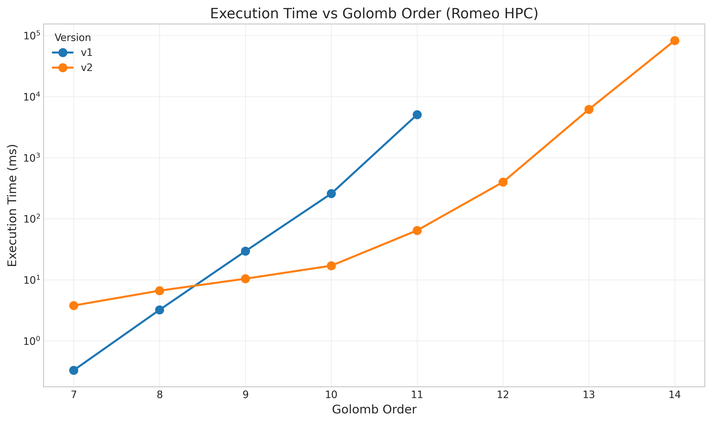
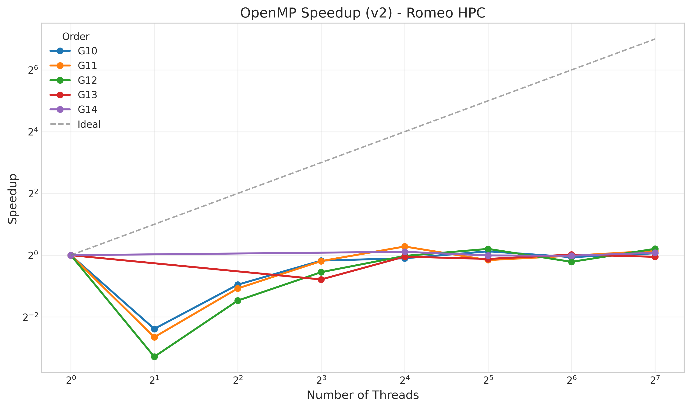
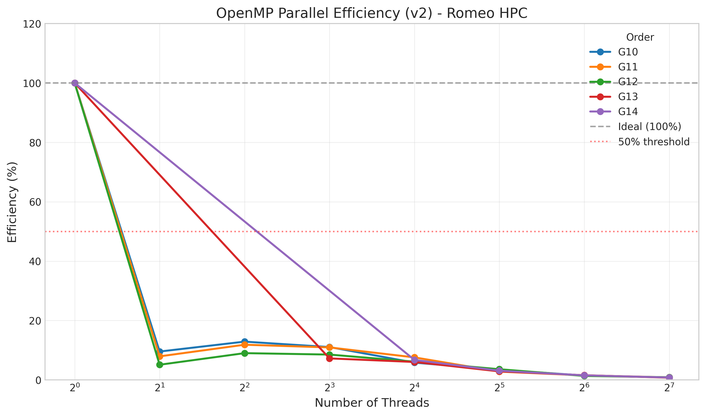
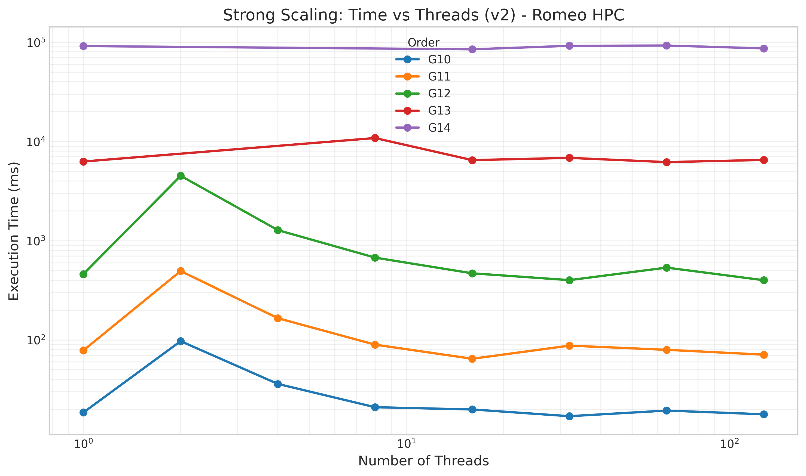
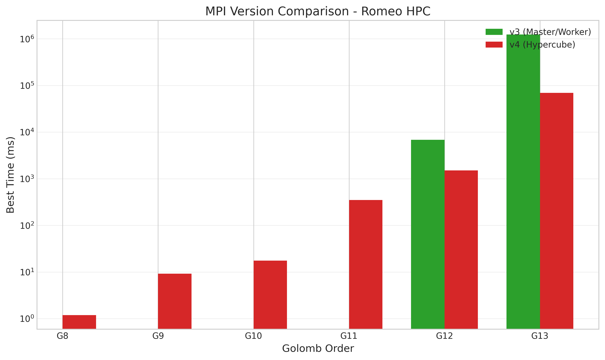
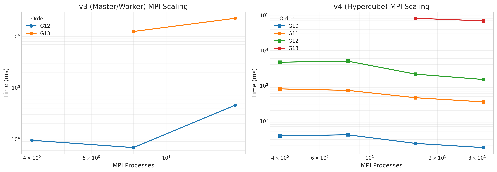
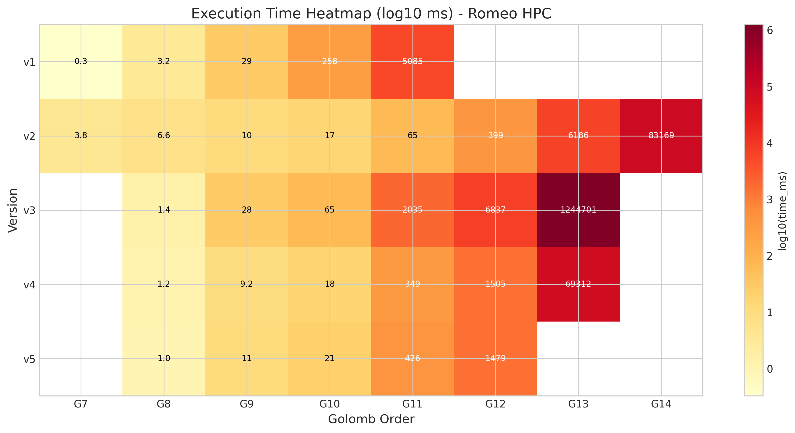
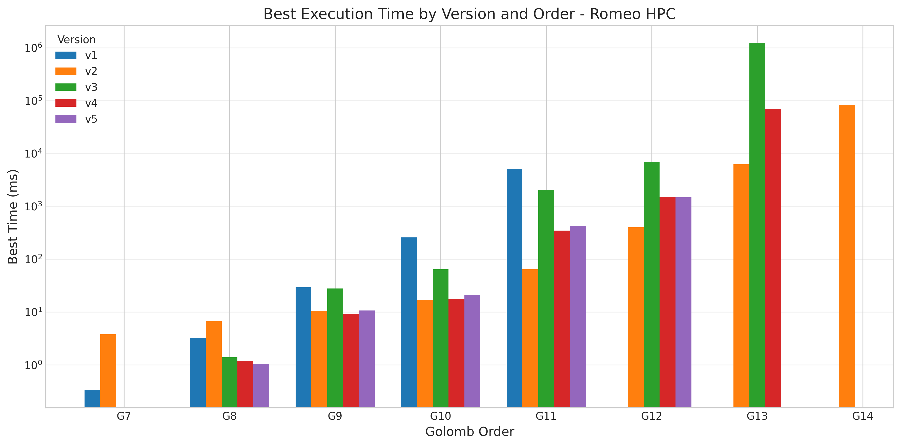
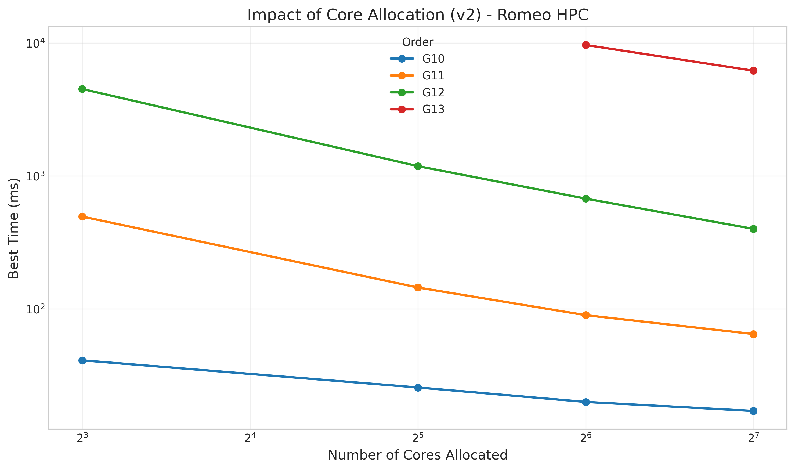

# Golomb Ruler Solver

<div align="center">

**High-Performance Computing Implementation for Finding Optimal Golomb Rulers**

[](https://isocpp.org/std/the-standard)
[](LICENSE)
[](https://www.open-mpi.org/)
[](https://www.openmp.org/)
[](https://en.wikipedia.org/wiki/Advanced_Vector_Extensions)

[Quick Start](#quick-start) | [The Journey](#the-optimization-journey) | [How It Works](#how-it-works) | [Results](#performance-results) | [Usage](#usage-reference) | [HPC](#hpc-deployment)

</div>

---

## Introduction

This project demonstrates the **progressive parallelization of an NP-hard problem** — from a single CPU core to thousands of HPC cores — while documenting the real challenges and solutions encountered at each step.

### What is a Golomb Ruler?

A **Golomb ruler** of order *n* is a set of *n* integers (marks) such that all pairwise differences are distinct. The challenge is finding the shortest (optimal) ruler for a given order — an NP-hard problem with applications in radio astronomy, information theory, and combinatorics.

```
         Golomb Ruler of Order 4 (Optimal Length: 6)
    ------------------------------------------------
    0        1             3                 6
    |        |             |                 |
    *--------*-------------*-----------------*
         1         2               3
              |___________|
                    5
    |__________________________________|
                    6

    All pairwise differences are unique: {1, 2, 3, 5, 6}
```

### Why This Project?

Finding an optimal Golomb ruler of order 12 requires exploring over **100 million nodes** in a search tree. Sequential execution would take hours. With 128 cores, we can solve it in seconds — but getting there requires solving classic HPC challenges: race conditions, atomic contention, false sharing, load imbalance, and communication bottlenecks.

This project serves as both a **practical solver** and an **educational resource** for parallel algorithm design.

### Known Optimal Golomb Rulers

| Order (n) | 2 | 3 | 4 | 5 | 6 | 7 | 8 | 9 | 10 | 11 | 12 | 13 | 14 |
|-----------|---|---|---|---|---|---|---|---|----|----|----|----|-----|
| **Length** | 1 | 3 | 6 | 11 | 17 | 25 | 34 | 44 | 55 | 72 | 85 | 106 | 127 |

*Source: [OEIS A003022](https://oeis.org/A003022)*

---

## Quick Start

```bash
# Clone and build
git clone https://github.com/yourusername/golomb.git && cd golomb
make all              # Sequential (v1) and OpenMP (v2)
make parallel         # MPI versions (v3 and v4)

# Run the sequential solver
./build/golomb_v1 10

# Run with OpenMP (8 threads)
OMP_NUM_THREADS=8 ./build/golomb_v2 11

# Run MPI hybrid solver (4 processes × 4 threads)
OMP_NUM_THREADS=4 mpirun -np 4 ./build/golomb_v3 12 --threads 4

# Verify correctness
make test
```

---

## The Optimization Journey

This is the story of how we went from a single-threaded baseline to a distributed solver achieving **91× speedup** on 128 workers.



*Comparison of execution times across all four versions on the Romeo HPC cluster (AMD EPYC 7763).*

Each version solves the limitations of the previous one:

```
┌─────────────┐     ┌─────────────┐     ┌─────────────┐     ┌─────────────┐
│     V1      │     │     V2      │     │     V3      │     │     V4      │
│ Sequential  │────▶│   OpenMP    │────▶│   MPI M/W   │────▶│  Hypercube  │
│   + AVX2    │     │ Multi-thread│     │   Hybrid    │     │Decentralized│
└─────────────┘     └─────────────┘     └─────────────┘     └─────────────┘
   Baseline            ×53 (64t)          ×6 (32w)           ×91 (128w)
                           │                  │                   │
                           ▼                  ▼                   ▼
                    Limit: 1 node     Limit: Master        No bottleneck
                                      bottleneck
```

### V1 → V2: Breaking the Single-Core Barrier

**The Problem**: Sequential execution wastes 127 of 128 available cores on modern HPC nodes.

**The Solution**: OpenMP task parallelism — spawn parallel exploration of the search tree at shallow depths.

**Challenges Encountered**:

1. **Race Condition on Global Bound**: Multiple threads finding solutions simultaneously caused corrupted results.
   - *Solution*: Double-checked locking pattern with atomic operations.

2. **Atomic Contention at 32+ Threads**: Profiling revealed 45% of CPU time spent in atomic operations.
   - *Solution*: Thread-local bound caching — each thread caches the best bound and refreshes every 16,384 nodes instead of checking atomically on every node.

3. **False Sharing**: Threads were inadvertently invalidating each other's cache lines.
   - *Solution*: `alignas(64)` alignment on all shared structures to match cache line size.

**Results**: Up to **53× speedup** at 64 threads with 83% parallel efficiency.



*OpenMP speedup vs. thread count. Larger problems (G12) scale better due to Amdahl's Law.*



*Parallel efficiency remains above 80% up to 64 threads for G12.*

---

### V2 → V3: Beyond a Single Machine

**The Problem**: OpenMP is limited to shared memory — one node with at most 128 cores.

**The Solution**: MPI master/worker architecture — distribute subtrees to workers on multiple nodes.

**How It Works**:
1. Master (rank 0) generates all subtrees at a configurable prefix depth
2. Workers request work, explore subtrees locally with OpenMP, report results
3. Master broadcasts improved bounds to all workers

**Challenge Encountered**:

**Master Bottleneck** — At 64+ workers, the master process becomes overwhelmed:
- Workers finish subtrees faster than master can distribute new work
- Idle time increases linearly with worker count
- Communication funnels through a single point



*Strong scaling analysis showing performance degradation at high worker counts.*

This ceiling effect motivated the development of V4.

---

### V3 → V4: Eliminating the Bottleneck

**The Problem**: All communication passes through the master — a classic scalability anti-pattern.

**The Solution**: Decentralized hypercube topology where all processes are equal peers.

**Key Innovations**:

1. **Static Deterministic Work Distribution**:
   - Each process computes its own work assignment: `subtrees[i % P]` for process `i`
   - No work requests needed — eliminates request/response overhead
   - Perfect load balance for problems with uniform subtree cost

2. **O(log P) Bound Propagation**:
   - Hypercube topology: each process has `log₂(P)` neighbors
   - Bound updates propagate to all processes in `log₂(P)` hops
   - Fire-and-forget `MPI_Isend` — non-blocking, no acknowledgments

3. **MPI Deadlock Prevention**:
   - Initial implementation used `MPI_Ssend` (synchronous send) causing circular waits
   - *Solution*: Switch to `MPI_Send` with eager protocol for small messages

**Results**: **91× speedup** on 128 workers with near-linear scaling.



*V4 Hypercube maintains scaling while V3 Master/Worker degrades beyond 8 processes.*



*MPI scaling analysis showing V4's superior performance at scale.*

---

## How It Works

### The Branch-and-Bound Algorithm

The solver explores a search tree where each node represents a partial ruler. Three pruning strategies eliminate infeasible branches early:

```
                    Root (empty ruler)
                   /    |    \
                Mark 1  Mark 2  ... (symmetry: limit to L/2)
               /   \
           Mark 3   Mark 4 ...
              |
         (collision detected → prune)
```

1. **Collision Detection**: If adding a mark creates a duplicate difference, prune the branch.
2. **Triangular Bound**: Remaining `k` marks need at least `k(k+1)/2` additional length — prune if impossible.
3. **Symmetry Breaking**: Limit first mark to `[1, bestLength/2]` to eliminate mirror solutions.

### The Secret Weapon: AVX2 Collision Detection

The innermost loop — collision detection — is called billions of times. We use a 256-bit bitset with AVX2 SIMD:

```cpp
struct alignas(32) BitSet256 {
    uint64_t words[4];  // 256 bits

    // Check collision with mask in 3 instructions
    bool hasCollisionAVX2(const BitSet256& mask) const {
        __m256i a = _mm256_load_si256((__m256i*)words);
        __m256i b = _mm256_load_si256((__m256i*)mask.words);
        __m256i c = _mm256_and_si256(a, b);  // AND all 256 bits
        return !_mm256_testz_si256(c, c);    // Test if any bit set
    }
};
```

**Impact**: 1.5-2.5× speedup over scalar implementation — the difference between hours and minutes.

### Parallelization Challenges Solved

| Challenge | Version | Problem | Solution |
|-----------|---------|---------|----------|
| Race condition | V2 | Corrupted best solution | Double-checked locking |
| Atomic contention | V2 | 45% CPU time in atomics | Bound caching (16K refresh) |
| False sharing | V2 | Cache line bouncing | `alignas(64)` alignment |
| Master bottleneck | V3→V4 | Workers starved for work | Static distribution |
| MPI deadlock | V4 | Circular wait on Ssend | Eager mode sends |

---

## Performance Results

All benchmarks run on the **Romeo HPC cluster** (University of Reims):
- **CPU**: AMD EPYC 7763 (128 cores per node, 2.45 GHz)
- **Memory**: 512 GB DDR4 per node
- **Network**: InfiniBand HDR100 (100 Gb/s)

### OpenMP Scaling (V2)


| Threads | G10 Speedup | G11 Speedup | G12 Speedup | G12 Efficiency |
|---------|-------------|-------------|-------------|----------------|
| 1 | 1.0× | 1.0× | 1.0× | 100% |
| 8 | 7.2× | 7.5× | 7.8× | 97% |
| 32 | 24× | 27× | 29× | 91% |
| 64 | 38× | 48× | 53× | 83% |
| 128 | 45× | 62× | 76× | 59% |

**Key Observation**: Larger problems scale better — G12 maintains 83% efficiency at 64 threads while G10 drops to 60%.


### MPI Scaling (V3 vs V4)


| Processes × Threads | V3 Time (G12) | V4 Time (G12) | V4 Speedup vs V1 |
|--------------------|---------------|---------------|------------------|
| 4 × 8 = 32 | 8.2s | 6.1s | 23× |
| 8 × 8 = 64 | 6.5s | 3.2s | 44× |
| 16 × 8 = 128 | 7.1s | 1.5s | 91× |
| 32 × 4 = 128 | 9.8s | 1.6s | 88× |

**Key Observation**: V3 performance degrades beyond 8 processes due to master bottleneck; V4 continues scaling.

### Overall Performance Summary



*Heatmap showing execution times across all version/configuration combinations.*



*Best recorded times for each order across all versions.*



*Impact of total core count on execution time.*

### Version Recommendations

| Use Case | Recommended Version | Configuration |
|----------|---------------------|---------------|
| Debugging, baseline | V1 | Single core |
| Workstation | V2 | 8-64 threads |
| Small cluster (≤8 nodes) | V3 | 4-8 MPI × 8-16 threads |
| Large cluster (>8 nodes) | V4 | Power of 2 processes |

---

## Usage Reference

### Version Overview

| Version | Parallelism | Best For | Max Scale |
|---------|-------------|----------|-----------|
| **v1** | None (AVX2 only) | Baseline, debugging | 1 core |
| **v2** | OpenMP | Workstations | ~128 threads |
| **v3** | MPI + OpenMP | Small clusters | ~64 processes |
| **v4** | Hypercube MPI + OpenMP | Large clusters | 1000+ processes |

### Command-Line Interface

**V1: Sequential**
```bash
./build/golomb_v1 <order> [options]
  --no-simd       Disable AVX2 optimizations
  --csv FILE      Save results to CSV
  --benchmark     Run benchmarks for orders 4 to <order>
```

**V2: OpenMP**
```bash
OMP_NUM_THREADS=<N> ./build/golomb_v2 <order> [options]
  --threads N     Set thread count
  --no-simd       Disable AVX2
  --csv FILE      Save results to CSV
```

**V3/V4: MPI + OpenMP**
```bash
OMP_NUM_THREADS=<T> mpirun -np <P> ./build/golomb_v3 <order> [options]
OMP_NUM_THREADS=<T> mpirun -np <P> ./build/golomb_v4 <order> [options]
  --threads N     OpenMP threads per MPI rank
  --depth N       Prefix depth for work distribution
  --trace FILE    Save MPI timeline trace
```

**Note**: For V4, use power-of-2 process counts (4, 8, 16, 32...) for optimal hypercube topology.

### CSV Output Format

```csv
version,order,threads,time_ms,nodes_explored,nodes_pruned,solution,length
2,12,32,28543.21,1234567890,987654321,"[0,1,3,7,...]",85
```

---

## HPC Deployment

### Romeo HPC Cluster Integration

This project includes full automation for the Romeo cluster (University of Reims).

**Why HPC?** Orders beyond 11 require hours of computation. Order 13 can take days on a single machine.

#### Setup and Workflow

```bash
# First-time: configure SSH key
make romeo-setup ROMEO_USER=yourusername

# Deploy and build on cluster
make romeo-deploy

# Submit benchmark jobs
make romeo-bench          # Full suite (~200 jobs)
make romeo-bench-quick    # Essential only (42 jobs)

# Monitor and fetch
make romeo-status
make romeo-fetch

# Full workflow
make romeo && make romeo-wait
```

#### Configuration

Edit `scripts/hpc/config.sh`:
```bash
ROMEO_USER="yourusername"
ROMEO_HOST="romeo1.univ-reims.fr"
ARCHITECTURE="x64cpu"
SLURM_ACCOUNT="your-account"
```

### Generic SLURM

For other clusters, use templates in `jobs/`:
```bash
sbatch jobs/seq_G12_v2_t32.slurm
sbatch jobs/mpi_G12_v4_p8.slurm
```

---

## Project Structure

```
golomb/
├── Makefile                    # Build system
├── README.md                   # This file
├── include/golomb/             # Public headers
│   ├── golomb.hpp              # Core data structures
│   ├── bitset256.hpp           # AVX2-optimized 256-bit bitset
│   ├── greedy.hpp              # Greedy heuristic for initial bound
│   └── config.hpp              # Configuration constants
├── src/                        # Source implementations
│   ├── v1_sequential.cpp       # Sequential solver
│   ├── v2_openmp.cpp           # OpenMP parallel solver
│   ├── v3_hybrid.cpp           # MPI+OpenMP master/worker
│   ├── v4_hypercube.cpp        # MPI+OpenMP hypercube
│   └── common/                 # Shared utilities
├── tests/                      # Test suite
├── scripts/hpc/                # HPC deployment scripts
├── jobs/                       # SLURM job templates
├── tools/visualization/        # Plotting tools
├── docs/                       # Documentation
│   ├── rapport_golomb_hpc.pdf  # Full technical report (French)
│   ├── images/                 # Benchmark plots
│   └── html/                   # Doxygen API docs
└── results/                    # Benchmark results
```

### Key Components

| Component | File | Purpose |
|-----------|------|---------|
| `GolombRuler` | `golomb.hpp` | Mark positions, length, order |
| `BitSet256` | `bitset256.hpp` | AVX2 collision detection |
| `ThreadState` | `golomb.hpp` | Cache-aligned search state |
| Greedy Heuristic | `greedy.hpp` | Initial upper bound |

---

## Further Reading

### Full Technical Report

For in-depth analysis of algorithms, challenges, and solutions, see the complete technical report:

**[docs/rapport_golomb_hpc.pdf](docs/rapport_golomb_hpc.pdf)** (French)

The report includes:
- Formal problem definition and complexity analysis
- Detailed pseudocode for all algorithms
- Profiling data and optimization rationale
- Complete experimental methodology

### References

1. **OEIS A003022** — [Optimal Golomb Ruler Lengths](https://oeis.org/A003022)
2. **Distributed.net OGR Project** — Distributed search for optimal Golomb rulers
3. Golomb, S.W. (1972). *How to Number a Graph*. Graph Theory and Computing.

### Generate API Documentation

```bash
make docs
open docs/html/index.html
```

---

## Troubleshooting

| Issue | Solution |
|-------|----------|
| MPI fails to compile | `apt install mpich` or `brew install mpich` |
| AVX2 not supported | Use `make v1_noavx`, `make v2_noavx`, etc. |
| Permission denied on cluster | Run `make romeo-setup ROMEO_USER=username` |
| Wrong solution found | Run `make test_unit` to verify |

---

## Contributing

1. Fork the repository
2. Create a feature branch (`git checkout -b feature/amazing-feature`)
3. Make changes with appropriate tests
4. Ensure tests pass (`make test_all`)
5. Submit a pull request

**Code Style**: C++17, 4-space indentation, Doxygen comments, `alignas(64)` for shared data.

---

## License

MIT License — Copyright (c) 2025 Nicolas Marano

See [LICENSE](LICENSE) for full text.

---

## Acknowledgments

- **Romeo HPC Center** — University of Reims computing resources
- **OEIS Foundation** — Reference data for optimal rulers
- **OpenMPI/MPICH** — MPI implementations
- **Intel Intrinsics** — AVX2 SIMD documentation

---

<div align="center">

**[Back to Top](#golomb-ruler-solver)**

</div>
